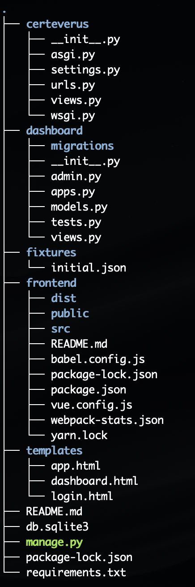

# Local Environment Setup

The Certeverux project uses Python 3 for backend code and Vue.js for frontend code.

The recommended way to setup the project is to use [venv](https://docs.python.org/3/library/venv.html) with [virtualenvwrapper](https://virtualenvwrapper.readthedocs.io/en/latest/install.html).

# Docker Build for Preview

* Install [Docker](https://docs.docker.com/get-docker/)

### Build production js/css assets
Inside the frontend directory run.

```bash 
    npm run build
```

### Build and Start Docker
Inside the main project directory run

``` bash
    docker-compose build
    docker-compose up
```

At this point you should be able to point your browser at 127.0.0.1:8000

# OSX Setup for Development:

### Start Postgres Docker Container

Make sure you have have [Docker](https://docs.docker.com/get-docker/) installed.
Navigate to main project directory and run:

``` bash
    docker-compose up db
```

### Setup Virtual Environment
```bash
pip install virtualenvwrapper
```
Now add the following lines to your shell config.  If you are using bash you can add them to .bash_profile or the end of .bashrc.  This should also work with zsh.

```bash
export WORKON_HOME=$HOME/.virtualenvs
source /usr/local/bin/virtualenvwrapper.sh
```
NB: On Ubuntu >= 17.04 use:
```bash
export WORKON_HOME=$HOME/.virtualenvs
source ~/.local/bin/virtualenvwrapper.sh
```

Now we need to create the python environment for the project. 

```bash
python3 -m venv ~/.virtualenvs/certeverus
```

### Clone the Certeverus repo
```bash
git clone git@github.com:DigX-Solutions/CerteVerus-AI-MVP.git certeverus
```

The project layout is shown below. 

* All of the front end code is in the frontend directory
* Site routing is handled by django in certeverus/urls.py
* Templates for the page are in the templates directory.



### Install Python Package and Setup backend
```bash
cd certeverus
pip install -r requirements.txt

# Run migrations
./manage.py migrate

# Load fixture Data
./manage.py loaddata fixtures/initial.json 
```


### Setup Npm
 The front end javascript code uses npm. 

 Install the latest npm globally

 ```bash
 npm install npm@latest -g
 ```

### Install Vue

```bash
sudo npm install -g @vue/cli
```

# Running the project

Ensure you have sourced the proper virtual environment.  If you followed the above directions you can do

```bash
workon certeverus
```

The fontend code is contained in the "frontend" directory.  Go ahead and navigate there.

```bash
cd certeverus/frontend
```

From here you can launch the front end server

```bash
npm run serve
```

Now open open another terminal and navigage back to the project directory 'certeverus'.
We now need to run the django development server.

```bash
./manage runserver
```

Open up your web browser and navigate to 127.0.0.1:8000.  You should be redirected to a login page.

Login with the test admin users (These won't be part of a production deploy):

username: admin
password: password123

After login you should be redirected to the 'dashboard' page.

### Admin section

The site also includes a basic admin site located at /admin.

# Development Guidelines

Make sure the Python code is linted with the following command

```bash
flake8 . --max-line-length=90
```

### Ingest data

```
# From server
./manage.py ingest_data
```

```
# Or  from docker
docker-compose exec app python manage.py ingest_data
```

### Debugging scripts

```
./manage.py shell < example/scripts/get_data.py
Se
```

